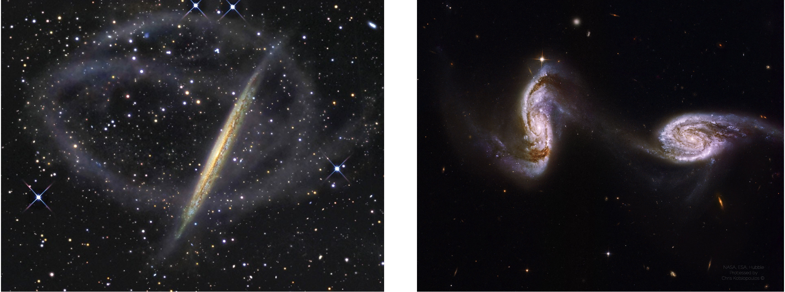
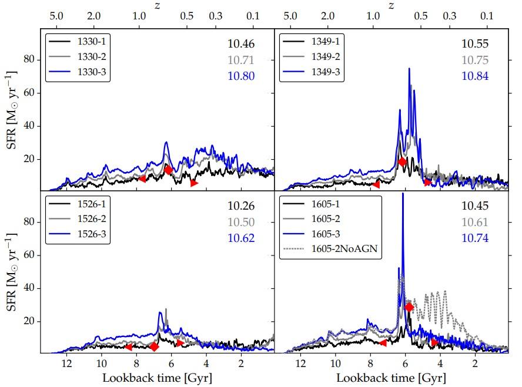

.. David O'Ryan Website documentation master file, created by
   sphinx-quickstart on Sat Nov 26 14:51:38 2022.
   You can adapt this file completely to your liking, but it should at least
   contain the root `toctree` directive.

David O'Ryan
***************

About
===========
I am a fourth year PhD Student at the `University of Lancaster <https://www.lancaster.ac.uk/>`_, UK. Here, I study galaxy formation and evolution using statistical methods under `Dr Brooke Simmons <https://vrooje.github.io/>`_. Prior to coming to Lancaster, 
I was an undergraduate at the `University of Glasgow <https://www.gla.ac.uk/>`_ where I completed an integrated Masters in Physics and Astronomy. I conducted my Masters project in Solar Physics under `Dr Nicolas Labrosse 
<https://www.gla.ac.uk/schools/physics/staff/nicolaslabrosse/>`_.

I am a junior associate in the `Legacy Survey of Space and Time <https://www.lsst.org/about>`_ collaboration. I am involved in preparing the Vera C. Rubin observatory for detecting low-surface brightness (LSB) galaxies and features, as well as building pipelines for galactic 
morphology identification for the very large datasets that will be observed. I am also a collaborator in the `Galaxy Zoo <https://www.zooniverse.org/projects/zookeeper/galaxy-zoo/>`_ collaboration. This collaboration is focused on using galaxy classification by volunteers
to explore large datasets. I am primarily focused on the archived `Galaxy Zoo: Mergers <https://mergers.galaxyzoo.org/>`_ project, where I am building algorithms to automate it and apply its methodology to large datasets.

My astrophysical research is primarily focused on galaxy evolution, specifically on putting constraints on interacting and merging galaxies. Not only are interacting galaxies observationally striking, the theory of :math:`\Lambda` Cold Dark Matter asserts that galaxies formed 
hierarchically meaning that this process is of paramount importance to galaxy evolution itself. It also directly affects how we see the universe, and the morphology of the systems around us. For example, interaction causes significant tidal disturbance by gravitational
interaction. This leads to many different features forming, like tidal tails, arms, bridges and even the total destruction of galaxies. Examples of such features are shown in the image below.

   Two examples of interacting galaxy types minor and merger. On the left hand side, we have the minor interacting system NGC 5907. The secondary galaxy was significantly less massive than the primary and has therefore been completely destroyed in the interaction. All that remains
   of it is the double cork-screw stellar stream about the primary. The right hand side shows an example of a major interaction, Arp 240. In this system, the primary and secondary galaxies have similar masses and therefore heavily distort and disturb. They show clear tidal features,
   with tidal tails on each galaxy and a tidal bridge linking the system.

There are also subtler effects of interaction between galaxies. A prime example is that of a starburst, where the gravitational disturbance between two systems can lead to a significant increase in star fomration rates (SFRs). This increase can range from a few times a galaxy's 
regular SFR to hundreds or thousands of times it. This sudden onset star formation creates distinct stellar populations in the galaxy, drastically changing how its spectrum will be observed. The underlying parameters (such as the galactic mass ratios, the impact parameter,
galactic sizes, or the orientation of the interaction) have direct effects on both the morphology and intensity of starbursts in the resultant system. My aim is that, by directly comparing observations to simulations, we will be able to distinguish which areas of underlying
parameter space lead to which features forming and give the strongest starbursts.

   Example of four simulated major mergers in the Illustris Zoom Simulation Project. The three coloured lines correspond to the factor of zoom-in used (with 1 lowest resolution and 3 being highest resolution). The numbers in the top right are the total stellar masses (logged)
   formed in each interaction. The red diamond is the point of coalescense and the red arrows are the defined beginning and end of the interaction by the simulation. As can be seen, each system has a massive increase in star formation rate around the time of coalescence with
   with a rapid decline immediately afterwards. Different underlying parameters lead to wildly different star formation histories of each system. This is Figure 1 in `Sparre & Springel (2016) <https://arxiv.org/pdf/1604.08205.pdf>`_.

To do this, I have developed a new, fast galaxy interaction simulation tool to rapidly output resultant systems for different combinations of underlying parameters. Using this algorithm, we have found we are able to constrain individual systems, and have applied it to all interacting 
systems in the Galaxy Zoo: Mergers sample. The results of this will be shown in an upcoming paper (O'Ryan et al. (in prep)). However, this is a very small subset of major interactions. To make any assumptions about the entire interacting galaxy population, we need large datasts which 
could encompass a large part of the population. Therefore, I have compiled a catalogue of 21,962 interacting galaxies from the Hubble Space Telescope science archives. The results of this have been written up in a submitted paper (O'Ryan et al. (submitted)). While this is one of the 
largest interacting galaxy catalogues to date, the next step in my PhD will be to apply the algorithm created to this dataset, and make inferences into the interacting galaxy population. 

Contact
===========
| David O'Ryan
| PhD Student
| Observational Astrophysics Group
| Lancaster University
| LA1 4YW
| UK
| email: d.oryan@lancaster.ac.uk (d *dot* oryan AT lancaster *dot* ac *dot* uk)

`GitHub <https://github.com/AstroORyan>`_ - `Twitter <https://twitter.com/davidoryan1>`_

.. toctree::
   :hidden:
   :maxdepth: 2
   :caption: Contents:

   cv
   projects
   internships
   teaching
   outreach
   publication